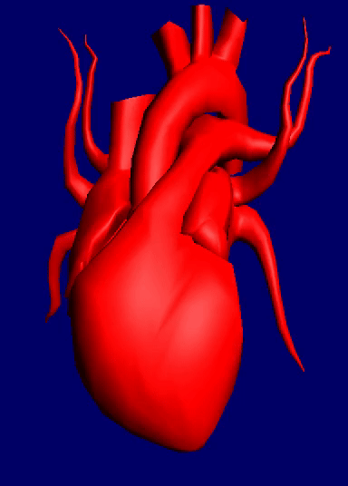

# Models-parametrization-lib
This library implements barycentric parametrization in affine bases. With this library you can create affine basis
(or several affine bases) and manipulate 3-dimensional geometry while you are changing basis.

Below we can see heart beating animation created with this library and OpenGL:



## Usage
```c++
// create basis
param::Basis b;
// create model
param::Model m(model_vertices);
// create worker
param::Worker w(m, b);
// transform model!
w.transformModel();
// then you can use transformed model
// for example in OpenGL:
std::vector<float> vtx = w.getModel().getVertices();
GLuint vertexbuffer;
glGenBuffers(1, &vertexbuffer);
glBindBuffer(GL_ARRAY_BUFFER, vertexbuffer);
glBufferData(GL_ARRAY_BUFFER, vtx.size() * sizeof(float), &vtx[0],
             GL_DYNAMIC_DRAW);
```
## Build instructions

You need compiler with C++11 support and CMake.

```sh
https://github.com/Fznamznon/Models-parametrization-lib.git
cd Models-parametrization-lib
mkdir build
cmake ..
make
```
## Documentation
Doxygen in plans.

## How it works
TBD.

## OpenGL sample build
The repository also contains OpenGL sample with heart beating.
Build of this sample is disabled by default because this sample has many dependencies.

Of course you can try to build it.
You need:
* CMake and compiler with C++11 support (as for param-lib)
* OpenGL. On my Ubuntu I installed following packages:
  * libx11-dev
  * libxi-dev
  * libgl1-mesa-dev
  * libglu1-mesa-dev
  * libxrandr-dev
  * libext-dev
* GLFW. On my Ubuntu I installed following package:
  * libglfw3-dev
* GLEW. On my Ubuntu I installed following package:
  * libglew-dev
* AssImp. On my Ubuntu I installed following package:
  * libassimp-dev
* glm. On my Ubuntu I installed following package:
  * libglm-dev
* In tests/CMakeLists.txt you need to uncomment line:
```cmake
# add_subdirectory(opengl-sample)
```
After this steps you can to try build this sample with library.
If I forgot something, please tell me about it. :)
